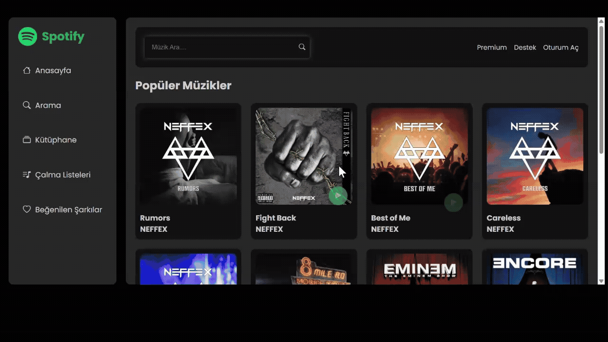

# Spotify Clone (Shazam v2 API Integrated) 🎵

Bu proje, Spotify'ın ikonik kullanıcı arayüzünü, **Shazam v2 API** üzerinden çekilen gerçek ve dinamik müzik verileriyle birleştiren gelişmiş bir web uygulamasıdır. Proje, Nisan 2026'da yayınlanan Shazam v2 endpoint güncellemelerine tam uyumlu hale getirilerek modernize edilmiştir.

## 🚀 Öne Çıkan Özellikler
* **Canlı Veri Senkronizasyonu:** RapidAPI üzerinden Shazam v2 endpoint'leri (`/v2/search`) kullanılarak gerçek zamanlı şarkı, sanatçı ve albüm kapak verilerinin çekilmesi.
* **Modern Müzik Çalar:** Dinamik olarak güncellenen player arayüzü, autoplay özelliği ve müzik durumuna göre tetiklenen görsel animasyonlar.
* **Gelişmiş Veri Eşleme (Data Mapping):** API'den gelen karmaşık JSON yapılarını (attributes, previews, artwork) parse ederek UI bileşenlerine aktarma.
* **Responsive Arayüz:** Tüm cihaz boyutları için optimize edilmiş Spotify karanlık tema tasarımı.

## 🛠️ Teknik Altyapı
* **JavaScript (ES6+):** Class tabanlı mimari, Async/Await mimarisi ve Modüler JS.
* **Shazam v2 API:** En güncel müzik veritabanı entegrasyonu.
* **CSS3 & SCSS:** Animasyonlar ve Spotify tasarım sadakati.
* **HTML5:** Semantik web yapısı.

## 🔄 Teknik Güncelleme Notları (Nisan 2026)
Proje, Shazam API'deki köklü yapısal değişikliklere göre güncellenmiştir:
- **Endpoint:** Eski `/search` yapısından yeni `/v2/search` yapısına geçildi.
- **Data Path:** Veri okuma yolu `tracks.hits` yerine `results.songs.data` olarak güncellendi.
- **Media:** Önizleme sesleri ve yüksek çözünürlüklü kapak fotoğrafları yeni `attributes` objesi üzerinden dinamik olarak eşlendi.

## 🔧 Kurulum
1. Repoyu clone'layın.
2. `api.js` dosyasındaki `x-rapidapi-key` alanına kendi RapidAPI anahtarınızı ekleyin.
3. VS Code üzerinden **Live Server** ile `index.html` dosyasını çalıştırın.

---
*Bu çalışma, API entegrasyonu ve modern frontend geliştirme pratiklerini sergilemek amacıyla geliştirilmiştir.*